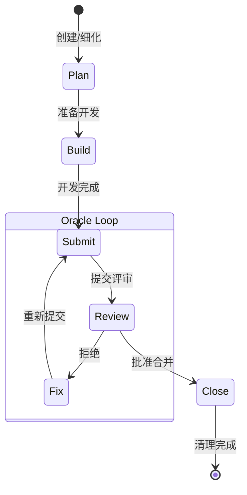

## FEAT-0130: 重构现有 issue-lifecycle-workflow

## Objective

在 FEAT-0128 和 FEAT-0129 完成后，重构现有的 `issue_lifecycle_workflow`，使其成为可选的**协调器 (Orchestrator)** 或**废弃**。

当前 `issue_lifecycle_workflow` 过于臃肿，混合了 6 个阶段（Open→Start→Develop→Submit→Review→Close）。重构后，它可以选择：
1. 作为高层协调器，组合新的原子 Flow Skills
2. 直接废弃，由原子 Skills 完全替代

**目标位置**: `monoco/features/issue/resources/skills/issue_lifecycle_workflow/`

## Acceptance Criteria

- [ ] 评估现有 `issue_lifecycle_workflow` 的使用情况
- [ ] 决定重构策略（协调器 vs 废弃）
- [ ] 更新或移除 Skill 文件
- [ ] 更新相关文档和引用
- [ ] 验证 `.claude/skills/` 同步正确

## Technical Tasks

### Phase 1: 评估与决策
- [ ] 搜索代码库中 `issue_lifecycle_workflow` 的引用
- [ ] 评估当前用户/Agent 对该 Skill 的依赖程度
- [ ] 决策：重构为协调器 OR 废弃

### Phase 2: 执行（如果重构为协调器）
- [ ] 重写 `SKILL.md`，定位为协调器
- [ ] 内部调用 `issue_create_workflow`, `issue_refine_workflow`, `issue_develop_workflow`
- [ ] 保留高层状态机，但步骤引用原子 Skills
- [ ] 更新 Mermaid 状态机图

### Phase 3: 执行（如果废弃）
- [ ] 标记 Skill 为 deprecated
- [ ] 在 `SKILL.md` 中添加迁移指南
- [ ] 通知用户改用原子 Skills
- [ ] 计划后续版本移除

### Phase 4: 验证
- [ ] 运行 `monoco sync` 验证 Skill 分发
- [ ] 检查 `.claude/skills/` 目录内容
- [ ] 更新 AGENTS.md 相关文档

## 重构方案对比

### 方案 A: 协调器模式（推荐）

```yaml
# issue_lifecycle_workflow/SKILL.md (重构后)
---
name: issue-lifecycle-workflow
description: Issue 生命周期协调器，组合原子 Flow Skills 提供完整流程
type: flow
domain: issue
version: 2.0.0
---

# Issue Lifecycle Workflow (Orchestrator)

> **注意**: 此 Skill 为协调器，内部调用以下原子 Skills:
> - `issue_create_workflow`: 创建阶段
> - `issue_refine_workflow`: 细化阶段
> - `issue_develop_workflow`: 开发阶段

## 工作流状态机



## 阶段与原子 Skill 映射

| 阶段 | 原子 Skill | 命令 |
|------|-----------|------|
| Plan | issue_create_workflow / issue_refine_workflow | 见对应 Skill |
| Build | issue_develop_workflow (Setup → Develop) | 见对应 Skill |
| Submit | issue_develop_workflow (Submit) | 见对应 Skill |
| Review | issue_develop_workflow (Review) | 见对应 Skill |
| Close | issue_develop_workflow (Close) | 见对应 Skill |
```

**优点**:
- 向后兼容：现有引用继续工作
- 渐进迁移：用户可逐步采用原子 Skills
- 降低认知负担：新用户可从协调器开始

**缺点**:
- 维护成本：需要维护协调器和原子 Skills
- 可能混淆：用户不清楚该用哪个

### 方案 B: 废弃模式

```yaml
# issue_lifecycle_workflow/SKILL.md (废弃)
---
name: issue-lifecycle-workflow
description: '[DEPRECATED] 请改用原子 Flow Skills'
type: flow
domain: issue
version: 1.0.0-deprecated
---

# ⚠️ DEPRECATED

此 Skill 已废弃，请改用以下原子 Flow Skills:

| 原阶段 | 替代 Skill |
|--------|-----------|
| Open (创建) | `issue_create_workflow` |
| Start/Develop (细化) | `issue_refine_workflow` |
| Develop/Submit/Review/Close (开发) | `issue_develop_workflow` |

## 迁移指南

### 场景 1: 从 Memo 创建 Issue
```bash
# 旧方式（已废弃）
# 参考 issue_lifecycle_workflow

# 新方式
参考 issue_create_workflow Skill
```

### 场景 2: 细化 Issue
```bash
# 旧方式（已废弃）
# 参考 issue_lifecycle_workflow

# 新方式
参考 issue_refine_workflow Skill
```

### 场景 3: 开发 Issue
```bash
# 旧方式（已废弃）
# 参考 issue_lifecycle_workflow

# 新方式
参考 issue_develop_workflow Skill
```
```

**优点**:
- 清晰明确：强制用户迁移到原子 Skills
- 减少维护：无需维护协调器逻辑
- 推动采用：促进原子化最佳实践

**缺点**:
- 破坏性变更：现有用户需要迁移
- 文档更新：需要更新所有引用

## 建议决策

基于当前项目状态，建议采用 **方案 A（协调器模式）**，原因：
1. 项目处于活跃开发期，需要保持向后兼容
2. 原子 Skills 是新概念，需要时间验证
3. 协调器可作为新用户的入门路径

在 v2.0 版本中，可以考虑完全废弃协调器。

## Dependencies

- FEAT-0128: 必须先完成 Copilot 原子 Skills
- FEAT-0129: 必须先完成 Autopilot Planner

## Related

- Parent: EPIC-0024
- Related: FEAT-0128, FEAT-0129

## Review Comments
<!-- Required for Review/Done stage. Record review feedback here. -->
