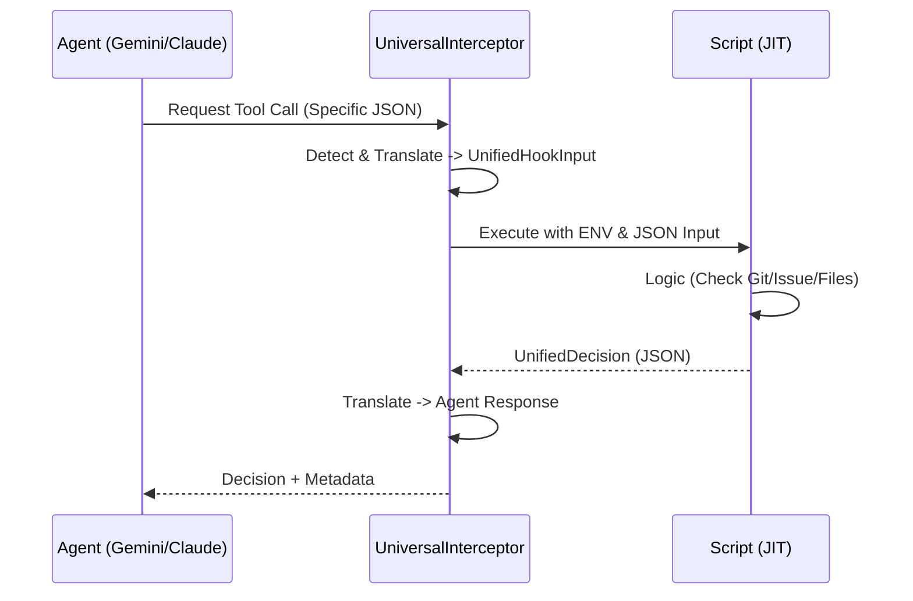

# Agent Feedback Loop: JIT Prompting 协议

本文详细定义了 Monoco 如何通过 Hooks 将环境反馈转化为 Agent 的即时行动指南。基于 `monoco.features.hooks.universal_interceptor` 实现。

## 1. 反馈环模型



## 2. 统一决策模型 (UnifiedDecision)

Monoco 定义了跨平台的决策结构：

```python
@dataclass
class UnifiedDecision:
    decision: str  # "allow", "deny", "ask"
    reason: str = ""
    message: str = ""
    metadata: dict[str, Any] = field(default_factory=dict)
```

### 2.1 字段语义

| 字段 | 类型 | 描述 |
| :--- | :--- | :--- |
| `decision` | Enum | **allow**: 放行。<br>**deny**: 拦截，Agent 必须处理失败。<br>**ask**: (高级) 请求用户介入。 |
| `reason` | String | 当 decision=deny 时的机器可读原因。 |
| `message` | String | **UI 反馈**。直接显示在 Agent 终端的消息。 |
| `metadata` | Dict | **隐形反馈**。Agent 框架适配器会将其转换为特定平台的上下文注入机制。 |

## 3. JIT 劝导策略

### 3.1 上下文注入 (Context Injection)

这是实现 JIT 劝导的关键。通过在 `metadata` 中返回特定字段，Hook 可以“偷偷”告诉 Agent 一些信息，而不仅仅是简单的报错。

**Gemini CLI 适配器实现**:
```python
# 自动将 metadata 中的 additionalContext 转换为 hookSpecificOutput
{
  "hookSpecificOutput": {
    "additionalContext": metadata.get("additionalContext")
  }
}
```

**Claude Code 适配器实现**:
```python
# 将 message 和 reason 组合返回
{
  "permissionDecision": "deny",
  "message": "Reason: ... Suggestion: ..."
}
```

### 3.2 典型劝导场景

#### 场景 1: 提交前同步检查 (Pre-Submit Sync)

**触发**: `before-tool` (针对 `git commit` 或 `submit`)
**逻辑**:
1. 读取 `UnifiedHookInput.env` 及其 metadata。
2. 检查 `monoco issue sync-files` 的状态。
3. 如果未同步：

```json
{
  "decision": "deny",
  "reason": "Unsynced Changes",
  "message": "🛑 你的 Issue 文件列表已过期。",
  "metadata": {
    "additionalContext": "Please run 'monoco issue sync-files' to update the tracked files list before submitting."
  }
}
```

#### 场景 2: 分支合规警告 (Branch Safety)

**触发**: `before-tool` (针对 `write_file`)
**逻辑**: 检查是否在 `main` 分支。
**响应**:

```json
{
  "decision": "allow",
  "message": "⚠️ 警告：你正在主分支上操作。",
  "metadata": {
    "additionalContext": "You are editing files on 'main'. This is generally discouraged. Please verify if you should be on a feature branch (FEAT-XXX)."
  }
}
```

## 4. 实现差异表

| 特性 | Monoco Unified | Gemini CLI | Claude Code |
| :--- | :--- | :--- | :--- |
| **事件名** | `before-tool` | `BeforeTool` | `PreToolUse` |
| **决策** | `allow` | `decision: allow` | `permissionDecision: allow` |
| **用户消息** | `message` | `systemMessage` | `message` |
| **上下文注入** | `metadata.additionalContext` | `hookSpecificOutput.additionalContext` | (通过 message 模拟) |