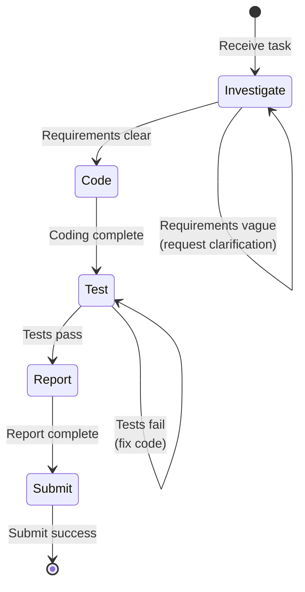

# Engineer Flow

Standardized workflow for Engineer role, ensuring code development follows the "Investigate → Code → Test → Report → Submit" process.

## Workflow State Machine

## Execution Steps

### 1. Investigate

- **Goal**: Fully understand requirements, identify technical risks and dependencies
- **Input**: Issue description, related code, dependent Issues
- **Output**: Technical solution draft, risk list
- **Checkpoints**:
  - [ ] Read and understand Issue description
  - [ ] Identify relevant code files
  - [ ] Check dependent Issue status
  - [ ] Evaluate technical feasibility

### 2. Code

- **Goal**: Implement feature or fix defect
- **Prerequisites**: Requirements are clear, branch is created (`monoco issue start <ID> --branch`)
- **Checkpoints**:
  - [ ] Follow project code standards
  - [ ] Write/update necessary documentation
  - [ ] Handle edge cases

### 3. Test

- **Goal**: Ensure code quality and functional correctness
- **Strategy**: Loop testing until pass
- **Checkpoints**:
  - [ ] Write/update unit tests
  - [ ] Run test suite (`pytest`, `cargo test`, etc.)
  - [ ] Fix failed tests
  - [ ] Check test coverage

### 4. Report

- **Goal**: Record change content, update Issue status
- **Checkpoints**:
  - [ ] Update Issue file tracking (`monoco issue sync-files`)
  - [ ] Write change summary
  - [ ] Update task checklist (Checkboxes)

### 5. Submit

- **Goal**: Complete code submission, enter review process
- **Checkpoints**:
  - [ ] Run `monoco issue lint` to check compliance
  - [ ] Run `monoco issue submit <ID>`
  - [ ] Wait for review results

## Decision Branches

| Condition | Action |
|-----------|--------|
| Requirements unclear | Return to Investigate, request clarification |
| Tests fail | Return to Code, fix issues |
| Lint fails | Fix compliance issues, resubmit |
| Review rejected | Return to Code, modify according to feedback |

## Compliance Requirements

- **Prohibited**: Skip tests and submit directly
- **Prohibited**: Directly modify code on main/master branch
- **Must**: Use `monoco issue start --branch` to create feature branch
- **Must**: All unit tests pass before Submit
