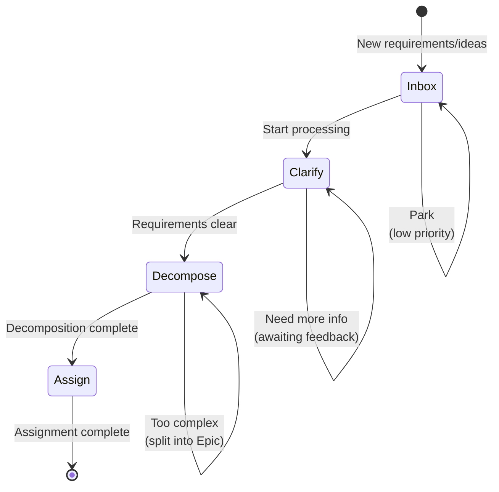

# Manager Flow

Standardized workflow for Manager role, ensuring the "Inbox → Clarify → Decompose → Assign" process.

## Workflow State Machine

## Execution Steps

### 1. Inbox

- **Goal**: Collect and temporarily store all incoming requirements, ideas, and tasks
- **Input**: Memo, user feedback, system alerts, technical debt
- **Checkpoints**:
  - [ ] Record requirement source and context
  - [ ] Initial classification (Feature/Chore/Fix)
  - [ ] Assess urgency

### 2. Clarify (Requirement Clarification)

- **Goal**: Transform vague requirements into clear descriptions
- **Strategy**: 5W2H Analysis Method
- **Checkpoints**:
  - [ ] **What**: What problem to solve?
  - [ ] **Why**: Why is it important?
  - [ ] **Who**: Who are the stakeholders?
  - [ ] **When**: Expected completion time?
  - [ ] **Where**: Scope of impact?
  - [ ] **How**: Suggested implementation approach?
  - [ ] **How Much**: Workload estimation?

### 3. Decompose (Task Decomposition)

- **Goal**: Break down large tasks into independently deliverable subtasks
- **Strategy**: Vertical Slicing
- **Checkpoints**:
  - [ ] Identify core value and dependencies
  - [ ] Split into independently deliverable Feature/Chore/Fix
  - [ ] Set reasonable priorities
  - [ ] Create Epic for complex tasks

### 4. Assign (Task Assignment)

- **Goal**: Assign tasks to appropriate executors
- **Checkpoints**:
  - [ ] Assess team capacity and workload
  - [ ] Define clear acceptance criteria
  - [ ] Set reasonable deadlines
  - [ ] Notify relevant members

## Decision Branches

| Condition | Action |
|-----------|--------|
| Requirements too vague | Return to Inbox, wait for more information |
| Task too complex | Create Epic, split into multiple Features |
| Depends on other tasks | Set dependencies, adjust priorities |
| Insufficient resources | Adjust scope or defer |

## Compliance Requirements

- **Must**: Every task has clear acceptance criteria
- **Must**: Complex tasks must be split into Epic + Features
- **Prohibited**: Assigning unclear requirements to Engineer
- **Recommended**: Use `monoco memo` to manage temporary ideas
