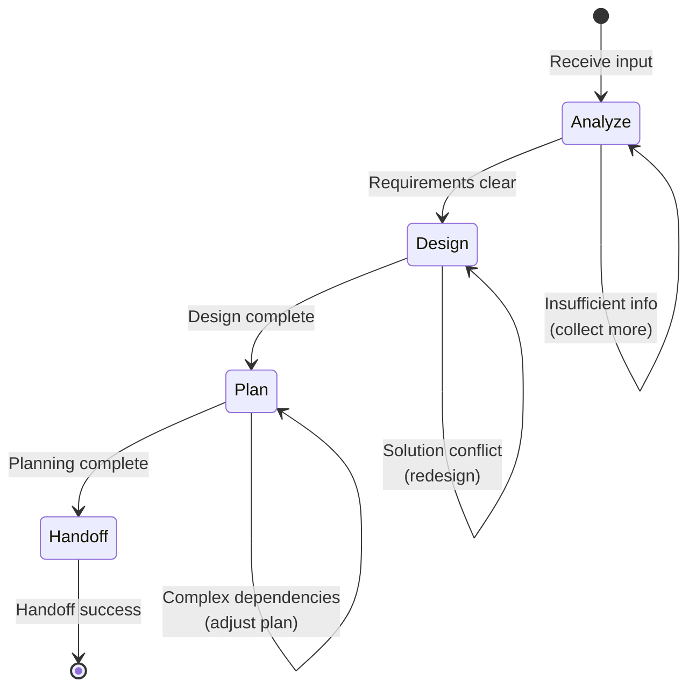

# flow_planner

Standardized workflow for Planner role (Flow Skill), responsible for analysis, design, planning, and handoff.

## Workflow State Machine



---

## Execution Steps

### 1. Analyze

**Goal**: Fully understand requirements and context

**Entry Conditions**:
- Received Memo or Issue input
- Or detected task that needs refinement

**Auto-execution Checkpoints**:

- [ ] **Read Input**: Read the complete content of Memo or Issue
- [ ] **Identify Context**: Identify relevant code files, modules, and dependencies
- [ ] **Check Architecture**: Check existing architecture and tech stack
- [ ] **Evaluate Scope**: Evaluate impact scope and complexity
- [ ] **Record Findings**: Record analysis results to Issue or create new research Issue

**Exit Conditions**:
- Requirements clear and explicit → Enter Design
- Insufficient information → Return to Analyze, collect more information

**Command Reference**:
```bash
# Read Memo
monoco memo list
monoco memo open <id>

# Read Issue
cat Issues/<type>/<status>/<issue-file>.md

# Check related code
grep -r "pattern" monoco/
```

---

### 2. Design

**Goal**: Produce architecture design solution

**Entry Conditions**:
- Analyze phase complete, requirements clear

**Auto-execution Checkpoints**:

- [ ] **System Architecture**: Design system architecture and component relationships
- [ ] **Inheritance Assessment**: Assess compatibility with existing system
- [ ] **Security Assessment**: Identify security risks and mitigation measures
- [ ] **Performance Assessment**: Evaluate performance impact and optimization solutions
- [ ] **Maintainability**: Consider maintainability and extensibility
- [ ] **Design Document**: Write architecture design document (Architecture Decision Record)

**Exit Conditions**:
- Design complete and self-approved → Enter Plan
- Architecture conflict → Return to Design, redesign solution

**Design Output Template**:
```markdown
## Architecture Design

### 1. System Architecture
[Architecture diagram or description]

### 2. Component Relationships
- Component A → Component B
- Interface definition: ...

### 3. Technology Selection
- Language/Framework: ...
- Dependencies: ...

### 4. Risk Assessment
| Risk | Impact | Mitigation |
|------|--------|------------|
| ...  | ...  | ...      |
```

---

### 3. Plan

**Goal**: Develop executable task plans

**Entry Conditions**:
- Design phase complete, architecture solution determined

**Auto-execution Checkpoints**:

- [ ] **Task Decomposition**: Break work into executable units (Issue/Feature)
- [ ] **Dependency Analysis**: Identify dependencies between tasks
- [ ] **Effort Estimation**: Estimate effort and priority for each task
- [ ] **Create Issue**: Use `monoco issue create` to create subtasks
- [ ] **Update Parent Issue**: Update original Issue's task list and dependencies

**Exit Conditions**:
- Planning complete → Enter Handoff
- Complex dependencies → Return to Plan, adjust task decomposition

**Command Reference**:
```bash
# Create subtask
monoco issue create feature -t "Subtask Title" --parent <parent-id>

# Update Issue
monoco issue edit <id> --add-task "Task description"
```

---

### 4. Handoff

**Goal**: Hand off tasks to Engineer

**Entry Conditions**:
- Plan phase complete, tasks decomposed into executable units

**Auto-execution Checkpoints**:

- [ ] **Context Summary**: Generate complete context summary
- [ ] **Update Issue**: Update Issue description, include technical design and execution steps
- [ ] **Mark Status**: Mark Issue as `ready_for_dev`
- [ ] **Notify Engineer**: If system supports, notify Engineer of new tasks

**Handoff Document Template**:
```markdown
## Handoff Document

### Context
[Brief description of task background and goals]

### Architecture
[Key points of architecture design]

### Implementation Guide
[Implementation steps and notes]

### Acceptance Criteria
- [ ] Acceptance criteria 1
- [ ] Acceptance criteria 2

### Related Files
- `path/to/file1.py`
- `path/to/file2.py`

### Dependencies
- Dependent Issue: #XXX
- Blocking Issue: #YYY
```

**Exit Conditions**:
- Handoff success → Workflow ends

---

## Decision Branches

| Condition | Action | Description |
|-----------|--------|-------------|
| Insufficient information | Return to Analyze | Collect more information, may create Spike Issue |
| Architecture conflict | Return to Design | Redesign solution, record decision rationale |
| Complex dependencies | Return to Plan | Adjust task decomposition, simplify dependencies |
| Planning complete | Enter Handoff | Hand off to Engineer |

---

## Collaboration with Engineer

```
Planner (Analyze → Design → Plan)
         ↓
    Create/Refine Issue
         ↓
Engineer (Investigate → Code → Test → Submit)
         ↓
Reviewer (Review → Approve/Reject)
         ↓
    [If needed] → Return to Planner for re-planning
```

### Collaboration Interface

**Planner → Engineer**:
- Output: Refined Issue + Architecture design document
- Format: Issue description contains "## Implementation Guide" section
- Tag: Issue tagged as `ready_for_dev`

**Engineer → Planner**:
- Trigger: Engineer finds unclear requirements or architecture issues
- Action: Tag Issue as `needs_refine`, Planner re-engages

---

## Usage

### Manual Trigger

```bash
# Run as Planner role
monoco agent run --role Planner --input Issues/Features/open/FEAT-XXXX.md
```

### Auto Trigger

Auto-triggered when the following conditions are met:
1. New Memo created with `#plan` tag
2. Issue tagged as `needs_refine`
3. Epic created and needs to be decomposed into Features

---

## Best Practices

1. **Evidence Based**: All architecture decisions must be supported by code or documentation evidence
2. **Incremental Design**: Prioritize incremental design, avoid over-engineering
3. **Clear Boundaries**: Define clear module boundaries and interface contracts
4. **Document First**: Write design documents before creating implementation tasks
5. **Review Loop**: Complex designs should be reviewed before handoff

---

## Related Resources

- Role definition: `monoco/features/agent/resources/roles/planner.yaml`
- Engineer Flow: `.agent/skills/flow_engineer/SKILL.md`
- Reviewer Flow: `.agent/skills/flow_reviewer/SKILL.md`
