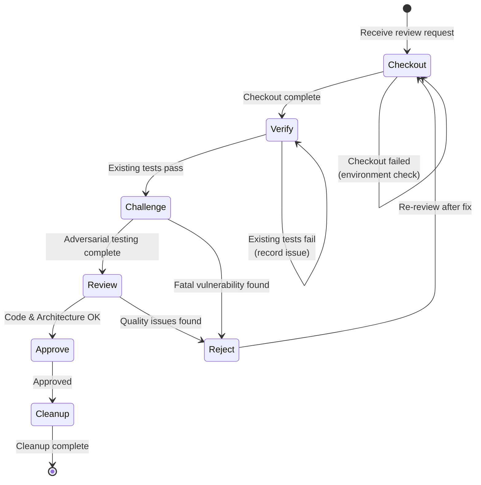

# Reviewer Flow

Standardized workflow for Reviewer role, ensuring the "Checkout → Verify → Challenge → Review → Decide → Cleanup" process. The core concept is the **dual-layer defense system**: Engineer is responsible for self-proof (Verify), Reviewer is responsible for challenge (Challenge).

## Workflow State Machine



## Execution Steps

### 1. Checkout

- **Goal**: Get the code to be reviewed
- **Checkpoints**:
  - [ ] Check out PR/Branch
  - [ ] Confirm differences from Base branch
  - [ ] Check environment configuration

### 2. Verify

- **Goal**: Verify Engineer's submitted functional correctness and test coverage (White-box)
- **Checkpoints**:
  - [ ] Run **Engineer's** unit tests
  - [ ] Run integration tests (if applicable)
  - [ ] Check test coverage report
  - [ ] **Decision**: If existing tests fail, directly enter `Reject` flow.

### 3. Challenge

- **Goal**: Try to break the code, find edge cases and security vulnerabilities (Black-box / Edge Cases)
- **Mindset**: "Try to break it"
- **Operations**:
  1. Analyze code logic, find blind spots from Engineer's perspective (concurrency, large/small values, injection attacks, etc.).
  2. Write new **Challenge Test Cases**.
  3. Run these new tests.
- **Checkpoints**:
  - [ ] **Vulnerability Found**: If new tests cause Crash or logic error -> **Reject** (and submit test case as feedback).
  - [ ] **Robustness Verified**: If new tests pass -> **Retain test case** (submit to codebase) and proceed to next step.

### 4. Review

- **Goal**: Check code quality, architecture design, and maintainability
- **Checklist**:
  - [ ] **Functionality**: Does the code implement the requirements?
  - [ ] **Design**: Is the architecture reasonable? Does it follow KISS principle?
  - [ ] **Readability**: Are naming and comments clear?
  - [ ] **Documentation**: Is documentation updated?
  - [ ] **Compliance**: Does it follow project Lint specifications?

### 5. Decide

- **Goal**: Make approve or reject decision
- **Options**:
  - **Approve**: Code is robust and compliant (including all passed Challenge Tests)
  - **Reject**: Needs modification, provide specific feedback (with failed Test Case or Log)
  - **Request Changes**: Minor issues, quick to fix

### 6. Cleanup

- **Goal**: Environment cleanup after review completion
- **Checkpoints**:
  - [ ] Submit new test cases (if any)
  - [ ] Delete local temporary branch
  - [ ] Update Issue status
  - [ ] Record review comments to Review Comments

## Decision Branches

| Condition                      | Action                                    |
| ------------------------- | --------------------------------------- |
| Existing tests (Verify) fail    | Reject, require Engineer to fix              |
| Adversarial tests (Challenge) crash | Reject, submit test case to prove vulnerability          |
| Code style issues              | Request Changes or provide suggestions              |
| Design issues              | Reject, require redesign                    |
| Everything normal              | Approve, and merge high-value Challenge Tests |

## Review Comments Template

```markdown
## Review Comments

### 🛡️ Challenge Reports

- [Pass/Fail] Test Case: `test_concurrency_limit`
- [Pass/Fail] Test Case: `test_invalid_inputs`

### ✅ Strengths

-

### ⚠️ Suggestions

-

### ❌ Must Fix

-

### 📝 Other

-
```

## Compliance Requirements

- **Must**: Pass Engineer's tests (Verify) first, then conduct adversarial testing (Challenge)
- **Must**: Attempt to write at least one edge case test case
- **Prohibited**: Direct Approve without testing
