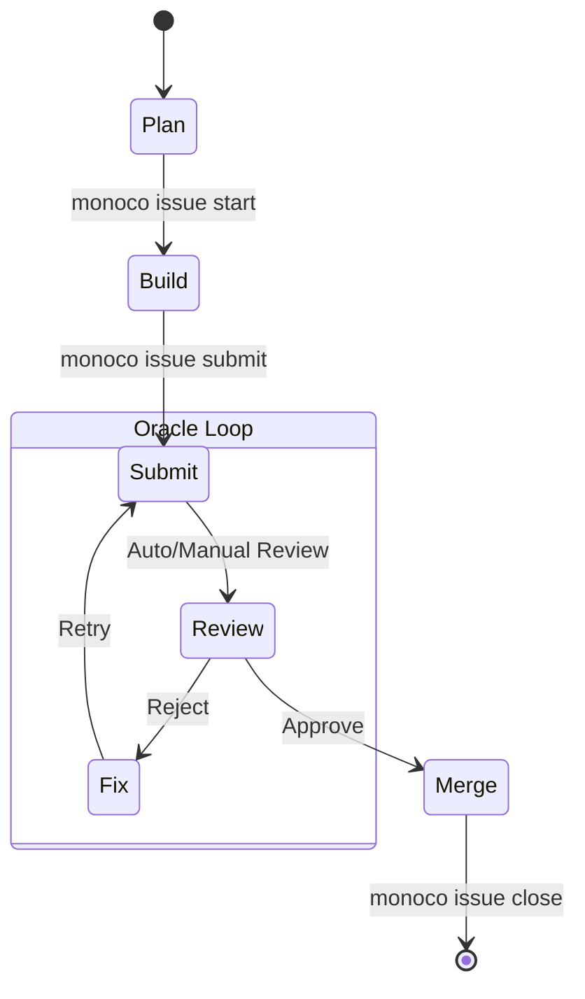

# Monoco Issue Workflow

This skill guides the agent through the standardized Monoco Issue Workflow.

## Core Concepts

The workflow consists of 4 atomic actions:

1.  **Plan**: Create/Edit Issue. Status: `Backlog` -> `Open` (Draft).
2.  **Build**: Start working. Status: `Open` (Doing).
    - Must use isolation (Branch/Worktree).
3.  **Submit**: Trigger Oracle/Validator. Status: `Open` (Review).
    - Run tests and linters.
    - Generate Delivery Report.
4.  **Merge**: Deliver value. Status: `Closed` (Done).
    - Squash merge and prune resources.

## Workflow Diagram

## Instructions

### 1. Plan Phase

- Ensure Issue exists and is in `Open` status.
- Verify requirements and tasks.

### 2. Build Phase

- Run `monoco issue start <ID>` (Verification: ensures branch is created).
- Implement features/fixes.
- Run `monoco issue sync-files` to track changes.

### 3. Submit Phase (Oracle Loop)

- Run `pytest` to ensure tests pass.
- Run `monoco issue lint`.
- Run `monoco issue submit <ID>`.
- **IF** errors/feedback received:
  - Fix issues.
  - Re-run tests.
  - Re-submit.

### 4. Merge Phase

- Once approved (conceptually or by user):
- Run `monoco issue close <ID> --solution completed --prune`.
